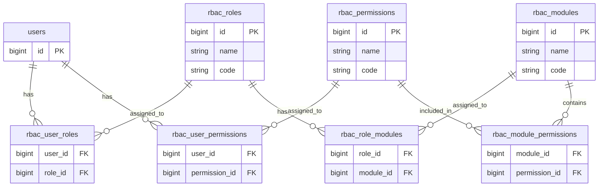

# RBAC Schema

```mermaid
erDiagram
    users {
        bigint id PK
    }

    rbac_roles {
        bigint id PK
        string name
        string code
    }

    rbac_permissions {
        bigint id PK
        string name
        string code
    }

    rbac_modules {
        bigint id PK
        string name
        string code
    }

    rbac_user_roles {
        bigint user_id FK
        bigint role_id FK
    }

    rbac_user_permissions {
        bigint user_id FK
        bigint permission_id FK
    }

    rbac_role_modules {
        bigint role_id FK
        bigint module_id FK
    }

    rbac_module_permissions {
        bigint module_id FK
        bigint permission_id FK
    }

    users ||--o{ rbac_user_roles : has
    rbac_roles ||--o{ rbac_user_roles : assigned_to

    users ||--o{ rbac_user_permissions : has
    rbac_permissions ||--o{ rbac_user_permissions : assigned_to

    rbac_roles ||--o{ rbac_role_modules : has
    rbac_modules ||--o{ rbac_role_modules : assigned_to

    rbac_modules ||--o{ rbac_module_permissions : contains
    rbac_permissions ||--o{ rbac_module_permissions : included_in
```
