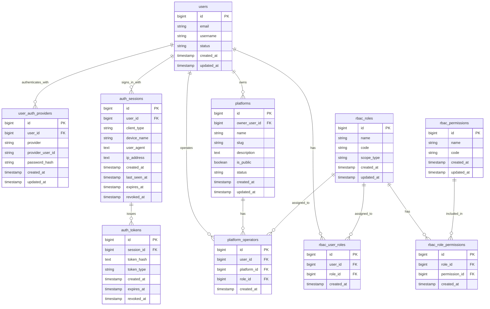

# Schema Design

```mermaid
erDiagram
    users {
        bigint id PK
        string email
        string username
        string status
        timestamp created_at
        timestamp updated_at
    }

    user_auth_providers {
        bigint id PK
        bigint user_id FK
        string provider
        string provider_user_id
        string password_hash
        timestamp created_at
        timestamp updated_at
    }

    auth_sessions {
        bigint id PK
        bigint user_id FK
        string client_type
        string device_name
        text user_agent
        text ip_address
        timestamp created_at
        timestamp last_seen_at
        timestamp expires_at
        timestamp revoked_at
    }

    auth_tokens {
        bigint id PK
        bigint session_id FK
        text token_hash
        string token_type
        timestamp created_at
        timestamp expires_at
        timestamp revoked_at
    }

    platforms {
        bigint id PK
        bigint owner_user_id FK
        string name
        string slug
        text description
        boolean is_public
        string status
        timestamp created_at
        timestamp updated_at
    }

    rbac_roles {
        bigint id PK
        string name
        string code
        string scope_type
        timestamp created_at
        timestamp updated_at
    }

    rbac_permissions {
        bigint id PK
        string name
        string code
        timestamp created_at
        timestamp updated_at
    }

    rbac_role_permissions {
        bigint id PK
        bigint role_id FK
        bigint permission_id FK
        timestamp created_at
    }

    rbac_user_roles {
        bigint id PK
        bigint user_id FK
        bigint role_id FK
        timestamp created_at
    }

    platform_operators {
        bigint id PK
        bigint user_id FK
        bigint platform_id FK
        bigint role_id FK
        timestamp created_at
    }

    users ||--o{ user_auth_providers : authenticates_with
    users ||--o{ auth_sessions : signs_in_with
    users ||--o{ platforms : owns
    users ||--o{ rbac_user_roles : has
    users ||--o{ platform_operators : operates

    auth_sessions ||--o{ auth_tokens : issues

    platforms ||--o{ platform_operators : has

    rbac_roles ||--o{ rbac_user_roles : assigned_to
    rbac_roles ||--o{ platform_operators : assigned_to
    rbac_roles ||--o{ rbac_role_permissions : has

    rbac_permissions ||--o{ rbac_role_permissions : included_in
```
